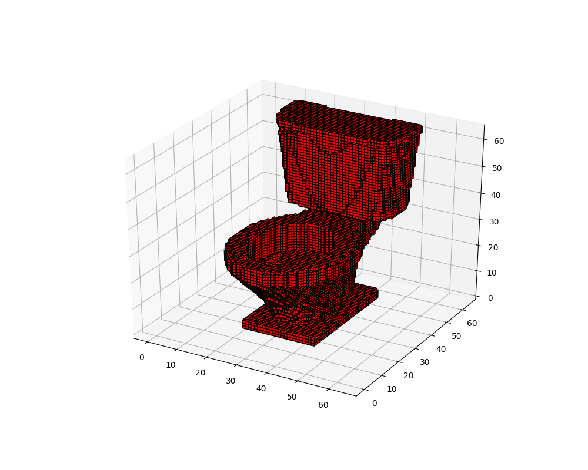

3d-Form
==============================

Can neural networks be leveraged to create novel 3D shapes?

MIDS W210 Capstone Final Project
------------

**Problem statement**: How can we influence 3D forms in an effort to aid in the design process?

**Customer**: Design oriented professions. E.g. automotive engineers, architects, design specialists, game designers, etc.

**Value Proposition**: Our service will allow a user to test 3D forms to envision a new mashup object, aiding brainstorming and sparking new ideas for designers

**Definition of Success**: Bringing our algorithm from concept to physical reality - successfully printing an original product

For more information on the project, contributors, and MIDS, please visit our project's website: http://people.ischool.berkeley.edu/~dave.owen/

Technical Introduction
------------

This project utilized a 3D Voxel-Based VAE capable of learning and reconstructing 3D objects. These 3D objects can be combined and manipulated via the VAE's latent vector. We trained a model for 200 epochs on 78,000+ shapes to create a model capable of producing quality reconstructions and mashups of objects at a 64x64x64 resolution.

**Original**

**Reconstruction**

For more information on our technical process, please review our [final presentation](reports/3d-mesh-mash-final-presentation.pdf).

And please review our references below to learn more about the published literature in this space.

Getting Started
------------

Make sure you have Python 3.6.x installed (Tensorflow doesn't support 3.7): https://www.python.org/downloads/

Linux:

* make create_environment
* activate.sh
* make requirements
* make data

Windows:

* install git with unix extensions
* install chocolatey from https://chocolatey.org/
* install make with "choco install make"
* make create_environment
* activate.bat
* make requirements
* make data

Note that if you wish to run this project on a GPU, you will need to checkout branch `tf_gpu`.

Running Experiments
------------

We make use of the sacred python package ([github](https://github.com/IDSIA/sacred), [docs](https://sacred.readthedocs.io/en/latest/index.html)) to manage our experimments.

Experiments are controlled via a json config file. You can view an example at src/configs/voxel_vaegan/config1.json.

Experiments are launched with `python train_vaegan.py with configs/voxel_vaegan/config1.json`. This will execute the script with the settings inside config1.json and store all outputs in a numbered directory of src/experiments.

*From A Notebook*

Experiments with the Voxel VAE-GAN can also be run within a notebook. Checkout notebooks/train_vaegan.ipynb. This notebook also incorporates sacred to track your experiments.

*Tensorboard*

The train_vaegan script and notebook support tensorboard with the proper config file settings. Tensorboard can be found at localhost:6006 or the 6006 port of whatever IP address your server is running on.

If tensorboard stops working and begins printing an error of "6006 already in use", try running this command in a terminal: top | grep tensorboard. If it returns a process, try "kill <pid>" where pid is the first number in the returned grep command.

Data
------------

* Dataset 1: [Thingi10k](https://arxiv.org/pdf/1605.04797.pdf) ([download link](https://drive.google.com/file/d/0B4_KyPW4T9oGRHdMTGZnVDFHLUU/edit) WARNING: it is 9gb _compressed_ and ~32gb _uncompressed_)
* Dataset 2: [ModelNet10](http://modelnet.cs.princeton.edu/)

Project Organization
------------

    ├── LICENSE
    ├── Makefile                <- Makefile with commands like `make data` or `make train`
    ├── README.md               <- The top-level README for developers using this project.
    ├── data
    │   ├── external            <- Data from third party sources.
    │   ├── processed           <- The final, canonical data sets for modeling.
    │   └── raw                 <- The original, immutable data dump.
    │
    ├── docs                    <- A default Sphinx project; see sphinx-doc.org for details
    │
    ├── models                  <- Trained and serialized models, model predictions, or model summaries
    │
    ├── notebooks               <- Jupyter notebooks
    │   └── train_vaegan        <- Primary notebook for model training
    │   └── experiment_review   <- Notebook for reviewing past and current experiment progress
    │   └── demos               <- Notebook for demonstrating project output in the 32x32x32 space
    │   └── demos-64            <- Notebook for demonstrating project output in the 64x64x64 space
    │
    ├── reports                 <- Generated analysis as HTML, PDF, LaTeX, etc.
    │   └── figures             <- Generated graphics and figures to be used in reporting
    │   └── demos               <- Generated output to demonstrate product
    │
    ├── requirements.txt        <- The requirements file for reproducing the analysis environment, e.g.
    │                              generated with `pip freeze > requirements.txt`
    │
    ├── setup.py                <- makes project pip installable (pip install -e .) so src can be imported
    └── src                     <- Source code for use in this project.
        ├── __init__.py         <- Makes src a Python module
        │
        ├── configs             <- Sacred model configuration files
        │
        ├── data                <- Scripts to download or generate data
        │   └── make_dataset.py
        │
        ├── models              <- Scripts to train models and then use trained models to make
        │
        └── tests               <- Python unit tests to validate source code

--------

<small>Project based on the <a target="_blank" href="https://drivendata.github.io/cookiecutter-data-science/">cookiecutter data science project template</a>. #cookiecutterdatascience</small>

References
------------

* Autoencoding beyond pixels using a learned similarity metric [[Paper](https://arxiv.org/pdf/1512.09300.pdf)]
* Learning a Probabilistic Latent Space of Object Shapes via 3D Generative-Adversarial Modeling (2016) [[Paper](https://arxiv.org/pdf/1610.07584.pdf)]
* Neural 3D Mesh Renderer (2017) [[Paper](http://hiroharu-kato.com/projects_en/neural_renderer.html)] [[Code](https://github.com/hiroharu-kato/neural_renderer.git)]
* Learning a Probabilistic Latent Space of Object Shapes via 3D Generative-Adversarial Modeling [[Paper](http://3dgan.csail.mit.edu/)]
* Generating 3D-objects using neural networks [[Paper](http://www.diva-portal.org/smash/get/diva2:1218064/FULLTEXT01.pdf)]
* Analogy-Driven 3D Style Transfer (2014) [[Paper](http://www.chongyangma.com/publications/st/index.html)]
* Functionality Preserving Shape Style Transfer (2016) [[Paper](http://people.cs.umass.edu/~zlun/papers/StyleTransfer/StyleTransfer.pdf)] [[Code](https://github.com/happylun/StyleTransfer)]
* Generating 3D Mesh Models from Single RGB Images (2018) [[Paper](https://github.com/nywang16/Pixel2Mesh)]
